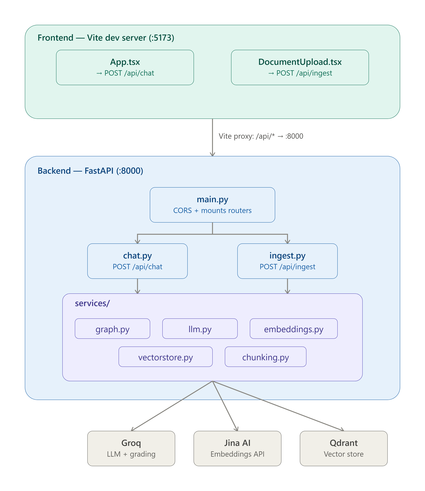
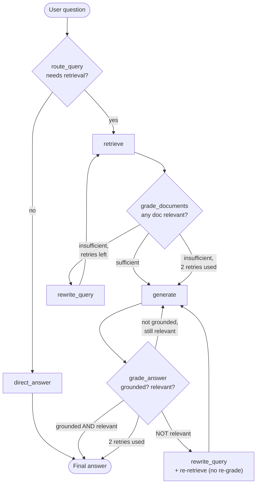
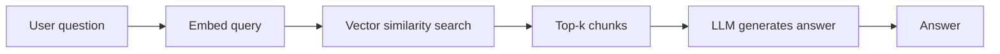
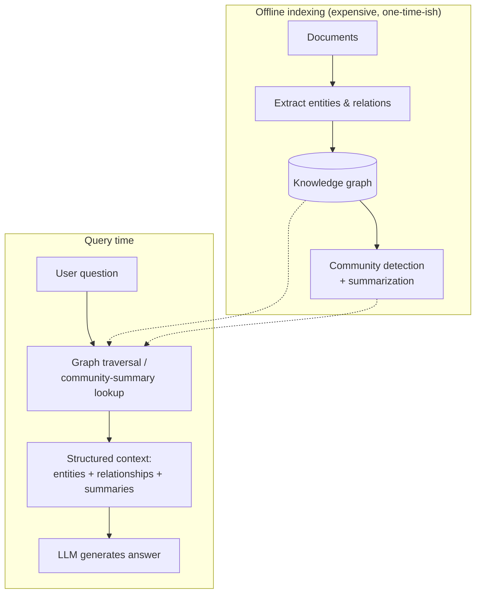

# Agentic Self-Correcting RAG (FastAPI + LangGraph + Vite)

A RAG pipeline that doesn't just retrieve-and-generate — it **decides whether to retrieve at
all, grades its own retrieval, rewrites failed queries, grades its own answer, and regenerates
when the answer is ungrounded or off-topic.** Built on Groq (LLM), Jina AI (embeddings), Qdrant
(vector store), orchestrated as a `langgraph.StateGraph`. FastAPI backend, Vite/React frontend.

---


## 1. How it works

The graph lives in `backend/app/services/graph.py` as a compiled `StateGraph`. Every box below
is a real node; every arrow is a real edge (including the conditional ones).



**Two independent self-correction loops:**

| Loop | Trigger | Action | Cap |
|---|---|---|---|
| **Retrieval loop** | Grader says none of the retrieved docs are relevant | Rewrite the search query, retrieve again | 2 retries, then proceeds best-effort |
| **Generation loop** | Answer isn't grounded in context, or doesn't address the question | Not grounded → regenerate from same docs. Not relevant → rewrite query, re-retrieve, regenerate | 2 retries, then returns best-effort answer |

Every node's output is appended to a `steps` trace (`operator.add` reducer in `GraphState`) —
the frontend renders this under each answer so you can see exactly which loops fired.

**Nodes**, in short:
1. **route_query** — cheap Groq call: does this need the knowledge base, or is it chit-chat / general knowledge?
2. **retrieve** — embed query (Jina `retrieval.query` task) → Qdrant vector search, top-5.
3. **grade_documents** — per-doc relevance grade (yes/no, cheap Groq grader model).
4. **generate** — answer using only graded-relevant context, with inline `[1] [2]` citations.
5. **grade_answer** — two separate grades: *grounded* (no hallucination) and *relevant* (on-topic).

---

## 2. How this differs from plain Semantic RAG and from GraphRAG

### Semantic (vector) RAG — the baseline



One straight pass. No check that the retrieved chunks are actually relevant, no check that the
answer is grounded, no retry if the first search misses. Fast and cheap, but silently wrong
when the embedding search returns near-miss chunks or the question needed a rephrase.

### GraphRAG — entity/relationship-centric



GraphRAG builds a knowledge graph (entities + relationships, often with community
summarization à la Microsoft's GraphRAG) at ingest time, then answers by traversing that graph
instead of — or alongside — vector search. It's strong at **multi-hop** and **"summarize
across the whole corpus"** questions ("how are X and Y connected?", "what are the main themes
across all documents?") that flat chunk-similarity search handles poorly, because the relevant
answer isn't sitting in any single chunk.

### Where this project sits

| | Semantic RAG | GraphRAG | This project |
|---|---|---|---|
| Retrieval unit | Flat text chunks | Graph entities/relations + community summaries | Flat text chunks |
| Index build cost | Low (embed + upsert) | High (LLM extraction pass over entire corpus) | Low (embed + upsert) |
| Self-correction | None | None (indexing-time quality, not query-time) | **Yes — retrieval loop + answer loop** |
| Handles multi-hop / cross-doc synthesis | Poor | **Strong** | Poor (single retrieval scope) |
| Handles "did I retrieve the right thing?" | No | No | **Yes (grade_documents)** |
| Handles hallucination detection | No | No | **Yes (grade_answer groundedness check)** |
| Query-time latency | Low | Low–medium | Medium–high (extra LLM grader calls, possible retries) |
| Best for | Simple lookup over a small-medium corpus | "How does X relate to Y across the corpus" style questions | Corpora where retrieval/generation quality varies and you'd rather pay extra latency than return a wrong answer |

In short: **semantic RAG optimizes for speed, GraphRAG optimizes for cross-document reasoning
structure, this project optimizes for answer reliability** by checking its own work at two
points in the pipeline. These aren't mutually exclusive — see improvement #1 below.

---

## 3. Possible improvements

1. **Hybrid GraphRAG retrieval** — add a graph-traversal retrieval node as a second source
   alongside Qdrant vector search (or as a fallback when `grade_documents` keeps failing),
   for questions that need cross-document/entity reasoning this pipeline currently can't do.
2. **Hybrid dense + sparse search** — combine Qdrant vector search with BM25/keyword search
   and fuse results (RRF); catches exact-term queries (IDs, names) that embeddings miss.
3. **Reranker between retrieve and grade_documents** — Jina's `jina-reranker-v2` (or Cohere
   rerank) to cut the grader's workload and push the truly relevant docs to the top before
   the expensive per-doc LLM grading pass.
4. **Structure-aware chunking** — replace the fixed-size chunker in `chunking.py` with
   heading/section-aware splitting (markdown headers, semantic chunking) to keep chunks
   coherent instead of splitting mid-thought.
5. **LangGraph checkpointing** — since the pipeline is now a real `StateGraph`, wire in a
   checkpointer (`MemorySaver` / Postgres) to persist state across turns — enables multi-turn
   conversational memory and resuming an interrupted run instead of restarting from scratch.
6. **Multi-hop query decomposition** — a node that splits a compound question into sub-
   questions, runs retrieve→generate per sub-question, then composes — narrows the gap with
   GraphRAG's multi-hop strength without a full graph index.
7. **Evaluation harness** — RAGAS or a custom eval set scoring faithfulness/answer-relevance/
   context-precision on a fixed question set, run in CI, so pipeline changes are measured
   instead of eyeballed.
8. **Observability** — trace every node + LLM call (LangSmith, or just structured logging) so
   retry storms and grader disagreements are debuggable in production, not just in the UI trace.
9. **Semantic caching** — cache (query embedding → answer) pairs for near-duplicate questions
   to skip the whole pipeline (and its multiple LLM calls) on repeat/similar queries.
10. **Guardrails / PII redaction** — filter both ingested documents and generated answers for
    sensitive data before it round-trips through Groq.
11. **Streaming answers** — stream the `generate` node's tokens to the frontend instead of
    waiting for the full pipeline (including regeneration retries) to finish before responding.

---

## 4. Project layout

```
backend/            FastAPI app
  app/
    main.py         app + CORS + routers
    config.py       env-based settings
    routers/        /api/chat, /api/ingest
    services/       graph.py (LangGraph pipeline), embeddings.py, vectorstore.py, llm.py, chunking.py
  scripts/ingest.py CLI bulk-ingest for local .txt/.md files
src/                Vite + React chat UI
  App.tsx           chat interface + step trace
  DocumentUpload.tsx file upload → /api/ingest
```

## 5. Setup

### Backend

```bash
cd backend
python -m venv .venv && source .venv/bin/activate   # Windows: .venv\Scripts\activate
pip install -r requirements.txt
cp .env.example .env   # fill in GROQ_API_KEY, JINA_API_KEY, QDRANT_URL, QDRANT_API_KEY
uvicorn app.main:app --reload --port 8000
```

Get keys: [Groq console](https://console.groq.com), [Jina AI](https://jina.ai/embeddings),
[Qdrant Cloud](https://cloud.qdrant.io) (free tier is enough to start).

### Ingest documents

Via the UI's upload button (posts to `/api/ingest`), the CLI script:

```bash
cd backend
python -m scripts.ingest ./data
```

or directly:

```bash
curl -X POST http://localhost:8000/api/ingest \
  -H "Content-Type: application/json" \
  -d '{"documents":[{"text":"...your text...","source":"notes.md"}]}'
```

### Frontend

```bash
npm install
npm run dev
```

Vite proxies `/api/*` to `http://localhost:8000`, so run the backend first.
Open the printed local URL (usually `http://localhost:5173`).

## 6. Deploying

- **Backend**: any long-lived Python process host — Render, Railway, Fly.io, a plain VM
  (`uvicorn app.main:app --host 0.0.0.0 --port $PORT`). Set the same env vars from `.env`,
  and set `CORS_ORIGINS` to your deployed frontend's URL.
- **Frontend**: `npm run build` → `dist/`, deploy as a static site (Vercel, Netlify,
  Cloudflare Pages, or served by the backend host). Point its fetch calls at your deployed
  backend URL instead of the local `/api` proxy.
